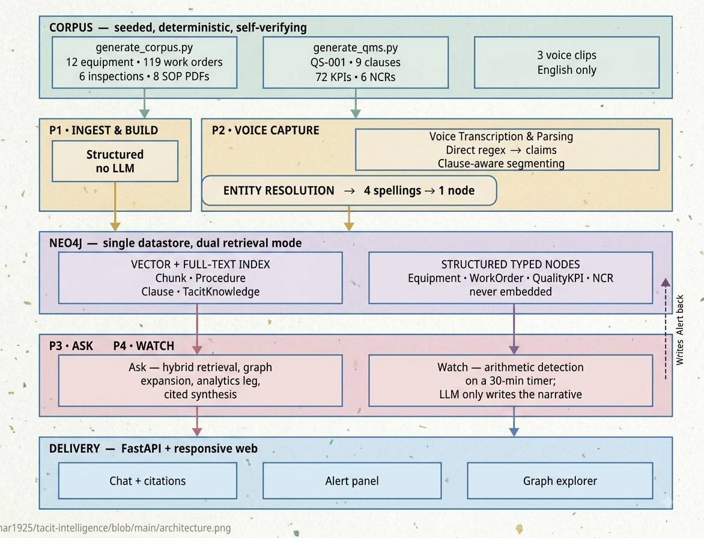

# Automotive_Bot

An AI-powered automotive assistant that combines **computer vision** and
**retrieval-augmented generation (RAG)** behind a single chat interface.

Ask it a question about cars and it answers from a knowledge base built out of
automotive news and reference documents — with source citations. Paste the path
to a car photo instead, and it identifies the car's **brand, model, year, and
colour** using a trained deep-learning model.

---

## Features

- **Car image recognition** — a multi-task ConvNeXt-Tiny CNN predicts brand,
  model, year, and colour from a single image.
- **RAG chatbot** — answers automotive questions strictly from an indexed
  knowledge base, returning the source document and page for every answer.
- **Automated knowledge pipeline** — scrapes automotive RSS feeds and Wikipedia,
  turns them into PDFs, runs GPU OCR, chunks, embeds, and loads everything into a
  vector database.
- **Autonomous research agent** — a background loop that crawls the web daily and
  keeps a ChromaDB collection up to date.
- **Unified web UI** — a lightweight chat front end served by a pure Python
  standard-library backend (no web framework required).
- **Terminal mode** — every core component can also be run directly from the
  command line.

---

## How it works



The web server inspects each incoming message. If it looks like a path to an
image file, the request is sent to the vision model. Otherwise it goes through
the RAG pipeline: the question is embedded, the most relevant chunks are
retrieved from the vector store, and a local LLM answers using **only** that
context.

---

## Project structure

```
Automotive_Bot/
│
├── core.py                     # Standalone rule-based chatbot (terminal + importable)
├── server.py                   # Pure-stdlib HTTP server; serves the UI and the /api/chat endpoint
│
├── automobile/                 # Computer-vision subsystem (car classifier)
│   ├── config.py               # Dataset path, image size, batch size, epochs, LR, save paths
│   ├── dataset.py              # CarDataset: walks brand/model/year/colour folders
│   ├── model.py                # CarModel: ConvNeXt-Tiny backbone + 4 classification heads
│   ├── train.py                # Training loop with AMP, checkpointing, and resume support
│   └── predict.py              # Loads the trained model and predicts on a single image
│
├── automotive_ai/              # RAG chatbot subsystem
│   ├── config.py               # Model/label save paths
│   ├── chat_gpu_frontend.py    # AutomotiveChatbot: Weaviate retriever + Ollama LLM (main class)
│   ├── build_gpu_db.py         # Builds the Weaviate vector DB from PDFs via GPU OCR
│   ├── daily_car_scraper.py    # Scrapes RSS + Wikipedia and writes daily PDF reports
│   ├── auto_research_agent.py  # Autonomous 24h web-crawl loop into a ChromaDB collection
│   ├── clean_all_csv.py        # Converts raw CSV/XLSX/DOC(X) source files to text
│   ├── text_to_pdf.py          # Converts cleaned text files into PDFs for the pipeline
│   └── fine1.py                # Two-pass LLM cleanup/structuring of extracted PDF text
│
└── frontend/                   # Chat web UI
    ├── index.html              # Chat layout ("AUTOBOT")
    ├── script.js               # Sends messages to /api/chat, renders the conversation
    └── style.css               # Styling (blue header, light chat area, typing indicator)
```

---

## Tech stack

| Area              | Technology |
|-------------------|------------|
| Deep learning     | PyTorch, torchvision (ConvNeXt-Tiny) |
| Vector database   | Weaviate Cloud (RAG), ChromaDB (research agent) |
| Embeddings & LLM  | Ollama (`nomic-embed-text`, `gemma3`, `llama3:8b`) |
| Orchestration     | LangChain |
| OCR               | EasyOCR (GPU), PyMuPDF (`fitz`) |
| Scraping          | feedparser, trafilatura, BeautifulSoup, Wikipedia |
| PDF generation    | ReportLab |
| Backend           | Python standard library (`http.server`) |
| Frontend          | Vanilla HTML / CSS / JavaScript |

---

## Getting started

### 1. Prerequisites

- **Python 3.10+**
- **[Ollama](https://ollama.com/)** running locally, with the required models pulled:
  ```bash
  ollama pull nomic-embed-text
  ollama pull gemma3
  ollama pull llama3:8b        # only needed for fine1.py
  ```
- A **[Weaviate Cloud](https://console.weaviate.cloud/)** cluster (free sandbox works).
- **NVIDIA GPU** recommended for training and OCR (CPU works but is slow).

### 2. Install dependencies

> A `requirements.txt` is not yet included (see *Known gaps* below). Install the
> main packages directly:

```bash
pip install torch torchvision pillow tqdm \
            langchain-core langchain-ollama langchain-weaviate \
            langchain-text-splitters langchain-community \
            weaviate-client chromadb ollama \
            easyocr pymupdf reportlab \
            feedparser trafilatura beautifulsoup4 wikipedia \
            python-dotenv schedule pandas python-docx
```

### 3. Configure environment

Create a `.env` file in the project root:

```env
WEAVIATE_URL=https://your-cluster-url.weaviate.cloud
WEAVIATE_API_KEY=your-weaviate-api-key
```

Update the dataset and folder paths in `automobile/config.py`,
`automotive_ai/config.py`, and `fine1.py` to match your machine (they currently
point at absolute paths from the original environment).

---

## Usage

### Build the knowledge base (RAG)

```bash
# 1. Collect source material (writes PDFs to car_reports/)
python automotive_ai/daily_car_scraper.py

# 2. (Optional) clean & convert raw files into pipeline-ready PDFs
python automotive_ai/clean_all_csv.py
python automotive_ai/text_to_pdf.py

# 3. OCR the PDFs, embed the chunks, and load them into Weaviate
python automotive_ai/build_gpu_db.py
```

### Train the car classifier

```bash
cd automobile
python train.py
# Resumes automatically from the latest checkpoint in checkpoints/
```

Expected dataset layout (DVM-CAR style):

```
resized_DVM/
└── <Brand>/
    └── <Model>/
        └── <Year>/
            └── <Colour>/
                └── image_0.jpg ...
```

### Predict on a single image

```bash
cd automobile
python predict.py "path/to/car.jpg"
```

### Run the web app

```bash
python server.py
# then open http://localhost:8000
```

### Run the chatbot in the terminal

```bash
python automotive_ai/chat_gpu_frontend.py   # RAG chatbot
python core.py                              # simple rule-based bot
```

---

## API

The backend exposes a small JSON API:

| Method | Endpoint       | Description |
|--------|----------------|-------------|
| `GET`  | `/`            | Serves the chat UI |
| `GET`  | `/api/history` | Returns the in-memory conversation history |
| `POST` | `/api/chat`    | Send a message and receive a reply |

**Request**
```json
{ "message": "What engine does the BMW 1 Series use?" }
```

**Response**
```json
{
  "reply": {
    "sender": "bot",
    "text": "...answer...",
    "sources": [{ "source": "doc.pdf", "page": 3 }],
    "time": "14:22"
  }
}
```

---

## Known gaps / TODO

The current repository is a working prototype. To make it fully runnable
end-to-end, the following are still needed:

- [ ] **`automotive_ai/car_predictor.py`** — imported by `chat_gpu_frontend.py`
      (`predict_car`) but not present in the repo. This is what bridges the chat
      layer to the trained vision model.
- [ ] **`__init__.py`** files so `automotive_ai` imports as a package.
- [ ] **`requirements.txt`** with pinned versions.
- [ ] **`.env.example`** template for the Weaviate credentials.
- [ ] Trained model artifacts (`car_model.pth`, `labels.pt`) or a download link.
- [ ] Replace the hard-coded absolute paths in the config files with
      relative/configurable paths (they currently mix Windows and Linux paths).
- [ ] Note: `clean_all_csv.py` uses `win32com` and is **Windows-only**.

---

## Notes

- The RAG assistant is deliberately constrained to answer **only** from retrieved
  context, and replies *"I couldn't find that information in the knowledge base."*
  when the answer isn't present — reducing hallucination.
- Everything (LLM, embeddings, OCR) runs **locally** via Ollama; only the
  Weaviate vector store is cloud-hosted.

---

## License

No license file is currently included. Add one (e.g. MIT) if you intend others to
reuse this project.
